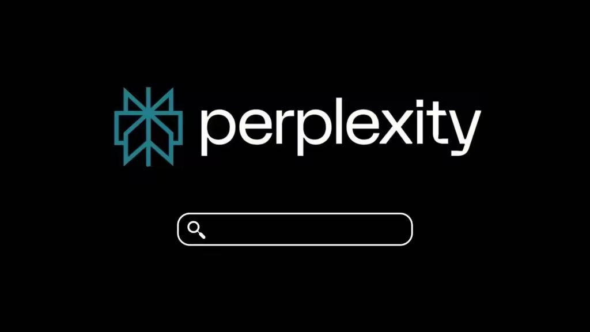

# Perplexity Pro：一个订阅搞定所有主流AI模型的搜索引擎

---

想用GPT-4.1、Claude 4.0、Gemini 2.5 Pro，但不想分别订阅？需要实时搜索又要深度推理？Perplexity Pro把这些需求打包成一个月20美元的方案。它不是传统聊天机器人，而是把搜索引擎和多个顶级AI模型整合在一起——你问问题，它实时抓取网页信息，用你选的模型分析，还附上来源链接。

---

## 它到底是什么

Perplexity Pro是个对话式搜索引擎的付费版。核心是Sonar模型——专门为快速检索设计的，20万token上下文窗口，速度快。但重点不在这，重点是你可以随时切换到其他模型。

现在能用的模型包括：

- **GPT-4.1**：OpenAI那套，处理复杂逻辑和代码任务稳
- **Claude 4.0 Sonnet**：Anthropic的，语言理解细腻，速度和深度都在线
- **Claude 4.0 Sonnet Thinking**：专门做深度推理的版本
- **Sonar**：自家模型，集成网页搜索，响应快
- **Grok 4**：xAI的推理模型，数学、科学、编码都能搞
- **Gemini 2.5 Pro**：谷歌的多模态模型，文本图像都能处理
- **R1 (1776)**：美国托管的微调版本，特定场景用
- **o3**：专注推理的模型，适合复杂分析

模型列表会更新，具体看官方页面。

## 价格怎么算

月付20美元，年付200美元。这个价格包括：访问上面那些模型、带引用来源的深度搜索、上传文件分析、用Pages和Labs做报告。👉 [想知道这个价格能帮你省多少订阅费？](https://pplx.ai/ixkwood69619635)

对比一下：单独订阅ChatGPT Plus、Claude Pro、Gemini Advanced，每个都要20美元左右。Perplexity Pro一个订阅全搞定，还附带实时搜索。

## 能做什么

### 1. 实时信息+来源链接

你问："美国、欧盟、印度最近6个月的通胀率是多少？给我数据和来源链接，顺便总结趋势。"

它会抓取最新数据，给你完整答案，每个数字都标注来源。不像普通聊天机器人只能靠训练数据瞎编，这个是实时抓的。

### 2. 分析文件内容

上传一篇PDF研究论文，问："500字内总结这篇论文的主要发现、方法和局限性，再给我3个受启发的研究问题。"

它读完文件，按要求输出。格式清晰，字数控制得刚好。

### 3. 处理复杂推理

上传超市销售数据集，要求：
1. 找出季节性或周末/工作日的销售规律
2. 标出异常值——销售额突然下降或飙升的日子
3. 预测下个月总销售额，解释推理过程
4. 给个100-150字的总结和月度销售预测表

它能完成所有要求，数据分析有理有据，预测逻辑清晰。

### 4. 多模态搜索（用Gemini 2.5 Pro）

上传一张电路图，问："分析这个电路图，逐步解释功能，然后建议如何提高效率。"

它识别出电路的每个组件，详细列出功能，还给出改进建议（虽然有点抽象，但方向对）。

## 为什么值得用

它不是又一个聊天机器人。它把搜索引擎和多个顶级AI模型整合在一起——你不用在ChatGPT、Claude、Gemini之间来回切换，也不用分别订阅。

灵活的模型选择、实时搜索、文件分析、多模态处理，月费20美元。如果你本来就要订阅多个AI服务，这个方案更划算。

## 适合谁用

- **经常做研究**：学术研究、行业调研、深度信息收集，Pro版的功能明显更强
- **需要多个AI模型**：不同任务需要不同模型，Pro让你随时切换
- **处理大量文件**：无限量上传和分析文档、数据集
- **想要定制化搜索**：自定义空间和网络资源，搭建自己的工作流程

---

## 总结

Perplexity Pro把实用的搜索助手升级成了研究和信息管理工具。在AI工具越来越多的今天，它提供了一个统一平台——不用追着最新模型跑，不用管理一堆订阅，一个账号搞定。对于需要实时信息、深度推理、多模态处理的用户，👉 [Perplexity Pro是个省钱又省心的选择](https://pplx.ai/ixkwood69619635)。
